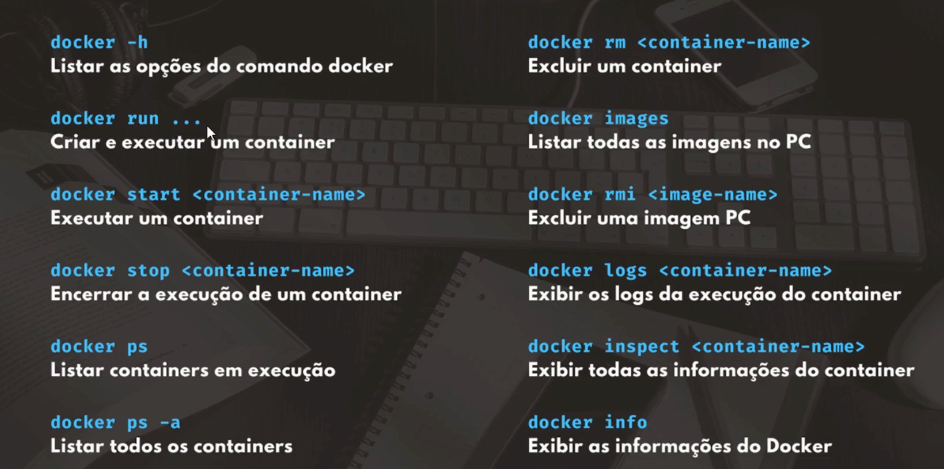

#Steps

##Type ORM.

### Install

- yarn add typeorm reflect-metadata pg

###Docs

- https://typeorm.io/

##Docker

- docker run --name postgres -e POSTGRES_PASSWORD=docker -p 5432:5432 -d postgres   
- docker psdocker 